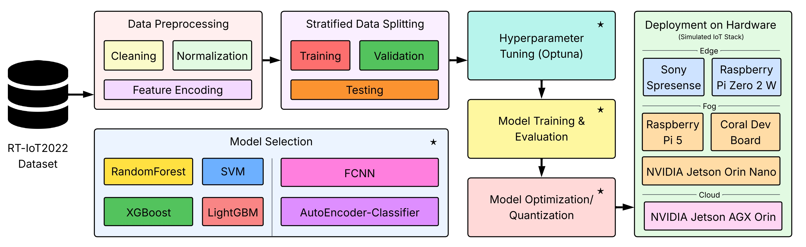

# From Sensor to Server: Deployable Lightweight ML for IoT Intrusion Detection Across Network Layers

_Ariel J. N. Panopio, Hamza A. Abushahla, Youssef Elmadany, Abdulaziz Alqasimi, Ali Reza Sajun, Sameer Alawnah, Fadi Aloul, and Imran A. Zualkernan_

This repository contains code and resources for the paper: "[From Sensor to Server: Deployable Lightweight ML for IoT Intrusion Detection Across Network Layers](https://ieeexplore.ieee.org/xpl/RecentIssue.jsp?punumber=4234)".

<div align="center">
  
</div>
<p align="center"><em>Figure 1: Proposed framework of the deployable ML-based IDS. The pipeline illustrates all stages—from data preprocessing to deployment of the models on selected hardware platforms. The hardware section is separated by a dashed line to indicate the deployment level (edge, fog, cloud). Another dashed line distinguishes classical ML models from DL models. Asterisks (*) denote stages where the models are utilized, including hyperparameter tuning, training & evaluation, and quantization.</em></p>


## 📌 Overview

This work presents a **deployable, lightweight machine learning (ML) framework for Intrusion Detection Systems (IDS)** designed to operate across **edge, fog, and cloud layers** of the IoT stack. Our key contributions are summarized as follows:

* We benchmark **six lightweight ML and DL models** (SVM, RF, XGBoost, LightGBM, FCNN, Autoencoder) on the **RT-IoT2022 dataset**.
* We conduct **automated hyperparameter tuning** using Optuna for each model, ensuring optimized performance while maintaining generalizability across deployment settings.
* We apply **Quantization-Aware Training (QAT)** to compress deep models (FCNN and Autoencoder) into efficient **INT8 variants**, reducing model size and latency without compromising detection accuracy.
* We **evaluate real-time deployment** across heterogeneous hardware—including **Sony Spresense** (edge), **Jetson Nano** (fog), and **Jetson AGX Orin** (cloud)—providing concrete latency, power, and memory usage benchmarks.
* We offer **practical insights on system design**, including window size and sampling rate considerations, to support real-time detection with minimal overhead.
* We release an **open-source, reproducible pipeline** that automates preprocessing, model tuning, quantization, and deployment testing, establishing a comprehensive baseline for future IDS development on IoT platforms.

---

## Dataset

## Models and Training

## Quantization and Deployment


## Citation & Reaching out
If you use our work for your own research, please cite us with the below: 

```bibtex

```

You can also reach out through email to: 
- Hamza Abushahla - b00090279@alumni.aus.edu
